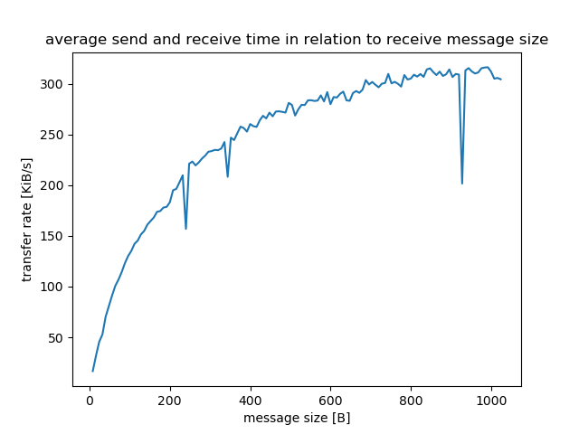
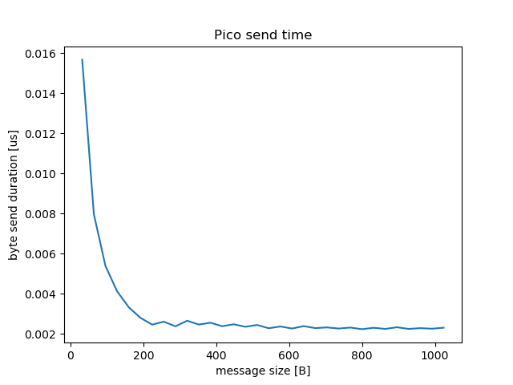
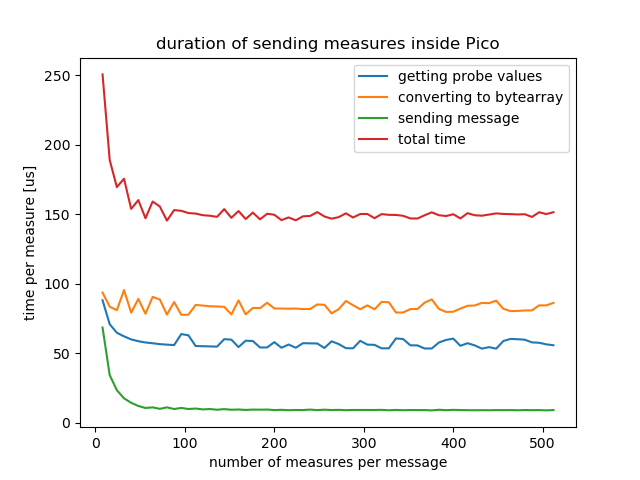
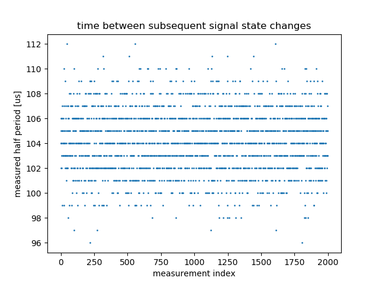
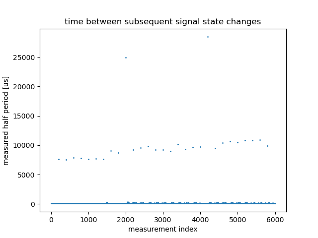
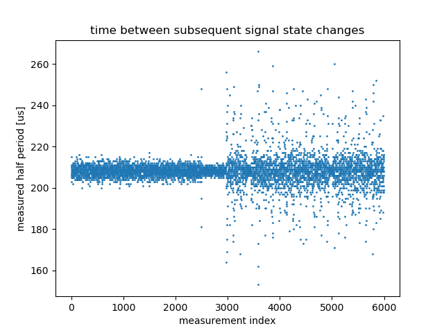

# picologicanalyzer

Logic state analyzer based on Raspberry Pi Pico board using MicroPython. Project done for educational purpose.

On Pico side, project uses pin interrupts and threading on second core. On host, communication (receiving data) and 
continuous plot drawing are split over separate processes.

Features:
- stream mode (continuous probe and display)
- reliable measurement of signal up to 6000Hz

## Table of content

1. [TL;DR](#tldr)
2. [Analyzer on Host](#hostanalyzer)
3. [Analyzer on Pico](#picoanalyzer)
4. [Reference device](#referencedevice)
5. [Performance analysis](#performance)
6. [Development](#development)
7. [References](#references)
8. [License](#license)

##  TL;DR

Following measurements and conclusions were taken:
- USB PC input buffer limit: ~6200B (might depend on OS)
- Pico to Host max transfer rate (using this implementation): 350KiB/s
- best Pico-to-Host transfer performance is achieved with message size greater than 200B
- sending single measurement takes ~150us (4 bytes: timestamp and value)
- stream mode measurement is reliable up to 6000Hz
- interrupt mode is more stable than polling pins for value
- garbage collector can trigger in any time
- hardware interrupts interrupt and temporarily disable garbage collector

##  Analyzer on Host

To start host analyzer run `src/host/run-analyzer.sh`.

Various samples and measurement scripts are placed in `src/host/sample`.

##  Analyzer on Pico

Source code for Pico is placed in `src/pico/` directory. To install the application do following steps:
1. install bootloader
	- connecting *Pico* to USB port with `bootsel` button pressed
	- run `src/pico/boot/upload-pico.sh` script or upload bootloader manually (`RPI_PICO-20240222-v1.22.2.uf2`)
	- reboot the board
2. upload the source code by `src/pico/send-pico-analyzer.sh --upload`
3. reboot the board

During the startup board's LED will blink 3 times (3 seconds in total). Then additional thread will start, so connecting 
to Pico using `rshell` or `ampy` will be not possible. So in case of accessing board remotely reset the board and connect 
to it within 3 seconds time window.

In case of problems the board can be cleared easily with script `src/pico/boot/reset-device.sh`. Before running the 
script reboot the board with `bootsel` button pressed.

Various sample programs are placed in `src/pico/sample`. To upload them to the board use dedicated scripts.

##  Reference device

In some time during implementation of this project there was need to have reference signal to measure. Test signal 
was generated using *AtTiny85* microchip. Sourcecode of the generator is placed in directory `src/referencedevice`. 
It contains helper script `src/referencedevice/testconnection-85.sh` and `src/referencedevice/attiny85/Makefile`.

#### Compilation
 
To set microcontroller fuse bits go to directory `src/referencedevice/attiny85` and execute `make fuse`.

To uploat program to the chip execute `make flash`.

Makefile is prepared to be used with *USBasp* compatible *AVR* programmer device.

##  Performance analysis

Following section describes couple of experiments performed using MicroPythion and Raspberry Pi Pico. If not stated otherwise, 
all experiments was taken on single channel probe connected to reference device pin generating state change with frequency 10kHz.

#### Host incoming buffer size

To determine size of incoming buffer scipt `src/host/sample/serial_buffer.py` was prepared. It shows that size of the buffer is 
more or less **6KB** (value might vary depending on Host hardware and operating system). After reaching the limit all further 
incoming data might be corrupted.

#### Pico to Host USB transfer rate

Measuring transfer rate from Pico to Host through serial USB port is implemented in script `src/host/sample/bytes_transfer.py`. 

Following image presents data transfer rate in function of transferred message size. Time measurement is taken on Host side. 
Experiment consists of measuring time of sending small message (few bytes) to Pico and receiving burst messages from Pico to Host.

It is clear that transfer rate is greater if message size is greater. Transfer limit lays around 350 KiB/s. There are couple of 
rate drops. It might be garbage collector disturbing data transfer.

#### Pico data send duration

Duration of sending data on Pico is measured by calculating time difference befor and after execution *send* command with 
proper payload. Experiment is implemented in file `src/host/sample/pico_send_time.py`. Results of experimets are shown on 
image below.

Greates performance gain goes around message size 200B. Then curve goes flat, so there is no significant performance improvement 
with increase of message size.

#### Duration of measurement inside Pico

Making measurement takes time. It consists of:
- taking probe vsalue from buffer,
- converting integer data to bytes,
- sending data to Host.

Duration of each step is measured on following image:

Best performance is gained for each message containig greater than 100 measurements. Moreover smallest possible total 
measurement time is ~150 us which corresponds to maximum possible frequency around 6600 Hz.

#### Pico signal measure quality

Checking stability of measurement is implemented in script `src/host/sample/measure_time_value.py`. Script generated 
following plot:

Plot presents measurements of generated signal with frequency 10kHz. All values fit into Pico internal buffer. 
This is the reason why measurement times are repeatable.

When measuring the same signal beyond buffer size (3000 measurements) results are different:

It can be seen that there is ~30 measurements that take 8ms. It is because during the experiment additional 30 commands 
are send to the board. Nature of other 2 deviations around 25ms is unknown. It might be garbage collector.

Measuring signal of 5kHz presents additional properties shown on following polot:

Deviation around measurement 2500 is result of command disabling keyboard interrupt. Then goes region of 500 measurements 
just before region of parallel sending and measuring. It can be seen that when the board handles communication then 
measurement is significantly disturbed.

##  Development

Running unit tests (on host):
- `src/testanalyzerlib/runtests.py`
- `src/host/testhostanalyzer/runtests.py`
- `src/pico/testhostanalyzer/runtests.py`

Static code check is done by script `tools/checkall.sh`.

To perform all tests and checks at once execute script `process-all.sh`.

Charts generation can be done by script `doc/generate-measurements-plots.sh`.

#### Interactive mode

*MicroPython* is accompanied with interactive mode.
To enter interactive Python mode (REPL) execute `src/pico/connect-pico.sh` and then type `repl`.

#### Generating protocol

To generate protocol codes do following steps:
1. define configuration `.json` file (example: `src/protogen/protocol.json`)
2. execute generator script `src/protogen/generate.sh` against the config file

Type `/src/protogen/generate.sh --help` for supported input arguemnts.

#### MicroPython limitations

- no support for `enum` classes
- no support for `abc` module
- RPi Pico RAM: 256KB
- RPi Pico Flash: 2MB
- configuring pin interrupts works only on core-0 (RPi Pico),
- connecting to MicroPython itself (REPL) requires one thread slot (core-1), so if it is used by Pico program, 
 then connection will fail

#### MicroPython optimizations conclussions

- lookup dict jest faster than *if chain*
- virtual methods dispatch takes simillar time to lookup dict
- measuring signal by hard interrupts on signal change is much more stable than polling loop because of garbage collector
- running interrupts on core-0 and main loop on separate core is more stable than running both on core-0
- sometimes synchronization mechanisms (locks) can be replaced by access to integers, because writing and reading from 
integer variable is atomic (single bytecode operation)

##  References

- [serial protocol generator](https://github.com/anetczuk/mpython-serial-protogen)
- [Raspberry Pi Pico documentation](https://www.raspberrypi.com/documentation/microcontrollers/raspberry-pi-pico.html)

##  License

BSD 3-Clause License

Copyright (c) 2024, Arkadiusz Netczuk <dev.arnet@gmail.com>

Redistribution and use in source and binary forms, with or without
modification, are permitted provided that the following conditions are met:

1. Redistributions of source code must retain the above copyright notice, this
   list of conditions and the following disclaimer.

2. Redistributions in binary form must reproduce the above copyright notice,
   this list of conditions and the following disclaimer in the documentation
   and/or other materials provided with the distribution.

3. Neither the name of the copyright holder nor the names of its
   contributors may be used to endorse or promote products derived from
   this software without specific prior written permission.

THIS SOFTWARE IS PROVIDED BY THE COPYRIGHT HOLDERS AND CONTRIBUTORS "AS IS"
AND ANY EXPRESS OR IMPLIED WARRANTIES, INCLUDING, BUT NOT LIMITED TO, THE
IMPLIED WARRANTIES OF MERCHANTABILITY AND FITNESS FOR A PARTICULAR PURPOSE ARE
DISCLAIMED. IN NO EVENT SHALL THE COPYRIGHT HOLDER OR CONTRIBUTORS BE LIABLE
FOR ANY DIRECT, INDIRECT, INCIDENTAL, SPECIAL, EXEMPLARY, OR CONSEQUENTIAL
DAMAGES (INCLUDING, BUT NOT LIMITED TO, PROCUREMENT OF SUBSTITUTE GOODS OR
SERVICES; LOSS OF USE, DATA, OR PROFITS; OR BUSINESS INTERRUPTION) HOWEVER
CAUSED AND ON ANY THEORY OF LIABILITY, WHETHER IN CONTRACT, STRICT LIABILITY,
OR TORT (INCLUDING NEGLIGENCE OR OTHERWISE) ARISING IN ANY WAY OUT OF THE USE
OF THIS SOFTWARE, EVEN IF ADVISED OF THE POSSIBILITY OF SUCH DAMAGE.
